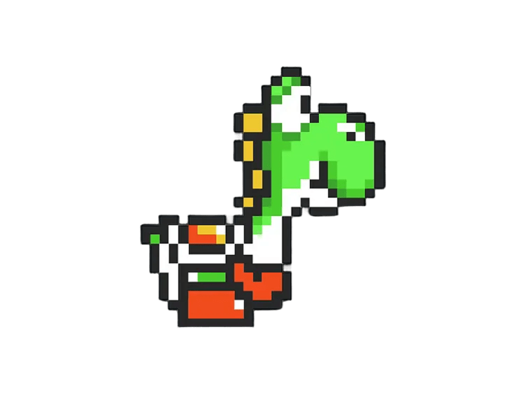
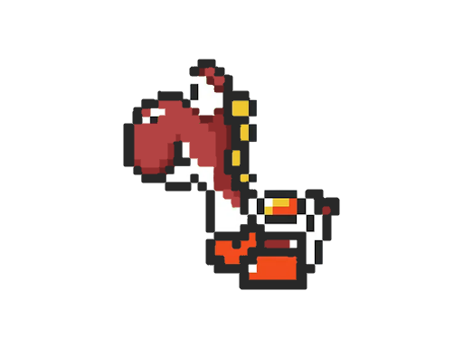

# 🎮 Juego_Gamefest2025
## 🏐 Nombre del Juego:
**Beach Volly**

---

### 🎯 Objetivo del Juego:
El objetivo del juego es marcar puntos haciendo que la pelota toque el suelo del lado del oponente. Cada jugador controla un personaje con apariencia de figura geométrica animada y deben golpear una pelota para enviarla al otro lado de la red.

---

### ⚙️ Mecánica General:
- Juego 1 contra 1: jugador contra jugador en modo local.
- Cada jugador puede **moverse horizontalmente y saltar**.
- La pelota tiene gravedad, **rebota progresivamente más alto y más rápido** con cada golpe.
- Gana el primero en llegar a **3 puntos**.

---

### 🎮 Controles:

**Jugador 1:**
- `A` y `D`: mover
- `W`: saltar

**Jugador 2:**
- `←` y `→`: mover
- `↑`: saltar

---

### 📏 Reglas del Juego:
- La partida comienza con un saque desde el centro.
- Si la pelota **toca el suelo** del lado de un jugador, el rival gana un punto.
- La pelota **no puede rebotar más de una vez** en el mismo jugador sin tocar otro objeto.
- El primero en alcanzar los puntos máximos gana.

---

### 🖼️ Elementos Visuales:

| Jugador 1 | Jugador 2 |
|----------|-----------|
|  |  |

- **Contorno negro grueso** (grosor 3) aplicado a todos los textos para mejorar su legibilidad.
- Fondo: imagen de cancha de voleibol (`img/cancha.png`).
- Red al centro del campo: línea azul oscura.
- Pelota blanca, circular, con rebote progresivo.

---

### 🔊 Sonido:
- **Música de fondo** (`sonidos/canciondefondo.mp3`) durante todo el juego.
- **Sonido de golpe de pelota** (`sonidos/pelota.mp3`) cada vez que un jugador impacta la pelota.
- Indicadores visuales con texto grande cuando **un jugador gana**.

---

### 👨‍👦‍👦 Integrantes:
- Andres Felipe Castillo Neira  
- Carlos Esteban Galvis Montaña  
- Eyersson Barcelly Montaña Chaparro
